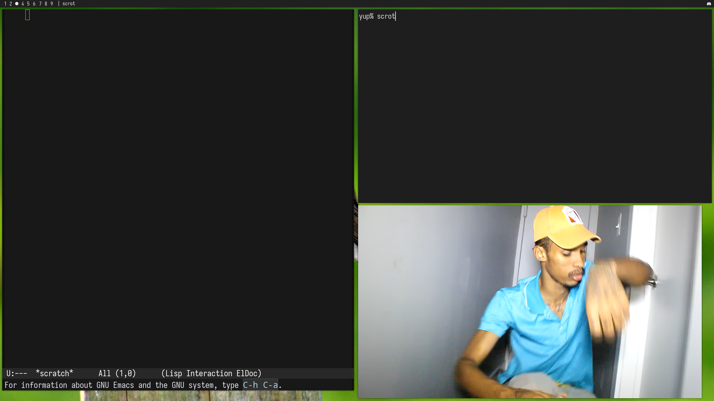

# mori


X11 tiling window manager in C, configured with Lua. Supports RandR monitors,
tile/monocle/floating layouts, ICCCM size hints, EWMH workspaces and dock struts,
and a user-session Unix socket for IPC. `mori-bar` is an optional Lua-configurable
panel with an XEmbed tray.

`make` builds all three programs and requires a C11 compiler, Make, pkg-config,
Xlib, Xrandr, Lua 5.4, Xft, and fontconfig. Build without the bar using
`make mori mori-ipc`. `make install` installs all programs, sample configurations,
and the X session entry. Set `PREFIX`, `DESTDIR`, or `LUA` as needed.

Configuration is trusted Lua with standard libraries enabled. Examples:
[config/config.lua](config/config.lua), [config/bar.lua](config/bar.lua).

## screenshots




## Window manager Lua API

`~/.config/mori/config.lua` returns the configuration table.

| Field | Type / semantics |
| --- | --- |
| `workspaces` | Array of 1–32 names; default: nine numbered names |
| `layout` | Initial layout: `tile`, `monocle`, `float`; default: `tile` |
| `master_count` | Integer 1–16; default: 1 |
| `master_ratio` | Number 0.1–0.9; default: 0.55 |
| `gaps`, `border_width` | Pixel integers; defaults: 8, 2 |
| `border_normal`, `border_focus` | X11 color strings; defaults: `#444444`, `#88c0d0` |
| `focus_follows_mouse` | Boolean; default: false |
| `keybindings` | Array of binding tables (below) |
| `rules` | Ordered window matching rules (below) |
| `monitors` | Preferred `{name, workspace}` assignments; workspace is 1-based |
| `startup` | Array of shell command strings, run once per session |
| `hooks` | Map of event names to callback functions |

Bindings use X11 keysym names and modifiers `Super`/`Mod4`, `Alt`/`Mod1`,
`Control`, and `Shift`. Each binding has `modifiers`, `key`, and either
`command`/`argument` or `action` (function); `action` takes precedence.

```lua
keybindings = {
    { modifiers = { "Super", "Shift" }, key = "r", command = "reload" },
    { modifiers = { "Super" }, key = "b", action = function()
        mori.command("layout", "monocle")
    end },
}
```

`mori.command(name, argument)` returns `true` or `false, error` and accepts the
IPC control commands, including `spawn`. `mori.spawn(shell_command)` runs
`/bin/sh -c` asynchronously. Both functions are available in callbacks, not
during config evaluation. Callbacks run on Mori's main thread.

Rules match all supplied fields: exact, case-sensitive `class` and `instance`
(WM_CLASS), and case-sensitive `title` substring. Rules apply in array order;
later properties override earlier ones. Supported properties: `workspace`
(1-based), `floating` (boolean), `fullscreen` (boolean). Rules apply when a
window is managed, not on reload.

Hooks receive `{event, workspace, monitor, window}`. Events: `startup`,
`workspace`, `focus`, `window_open`, `window_close`, `layout`, `monitor`,
`floating`, `fullscreen`, `title`, `workarea`, `reload`. Workspace and monitor
IDs are 1-based; X11 window IDs are unchanged; zero indicates no window or
unassigned workspace. Hook-triggered hook recursion is suppressed. Errors are
logged to stderr. Reload validates the replacement config before activation;
startup commands are not rerun.

## Bar Lua API

`~/.config/mori/bar.lua` returns the bar configuration. `format(state)` receives
read-only `workspaces`, `windows`, and `monitors` arrays (same fields as IPC
queries) and returns display text. It runs on redraw and state changes; errors
or non-string results fall back to the built-in display.

| Field | Type / semantics |
| --- | --- |
| `height`, `padding` | Integers 1–256 (default 26), 0–256 (default 8) |
| `position` | `top` or `bottom`; default `top` |
| `monitor` | RandR output name; default/unknown selects first output |
| `font` | Fontconfig pattern; default `monospace` |
| `foreground`, `background` | X11 color strings; defaults `#eeeeee`, `#202020` |
| `workspace_foreground`, `workspace_background` | Inactive label colors; inherit main colors |
| `workspace_active_foreground`, `workspace_active_background` | Focused label colors; inherit main colors |
| `workspace_padding`, `workspace_spacing` | Integers 0–256; defaults 4, 0 |
| `active_symbol` | Focused label; default `●`; empty retains workspace name |
| `show_title`, `title_separator` | Boolean (default true), text (default `" | "`) |
| `tray` | Boolean; default true |
| `tray_icon_size` | Integer 1–256; default 20, capped at bar height |
| `tray_spacing`, `tray_padding` | Integers 0–256; defaults 4, 8 |
| `tray_background` | X11 color string; defaults to `background` |
| `format` | Optional formatter function described above |

## IPC

`mori-ipc COMMAND [ARGUMENT]` sends a request to Mori and prints a JSON response.
Commands:

| Command | Argument |
| --- | --- |
| `workspaces`, `windows`, `monitors` | None; query state |
| `workspace`, `move-workspace` | Workspace number |
| `focus` | `next` or `prev` |
| `monitor` | `next`, `prev`, or monitor number |
| `layout` | `tile`, `monocle`, or `float` |
| `floating`, `fullscreen` | `on`, `off`, or `toggle` (default) |
| `master-ratio` | Number 0.1–0.9 |
| `spawn` | Shell command |
| `close`, `reload`, `quit`, `subscribe` | None |

Requests contain string `command` and optional string `argument`. Subscriptions
stream events after an acknowledgement; use a separate connection for queries
and commands. All IPC commands have the authority of the user's login session.
